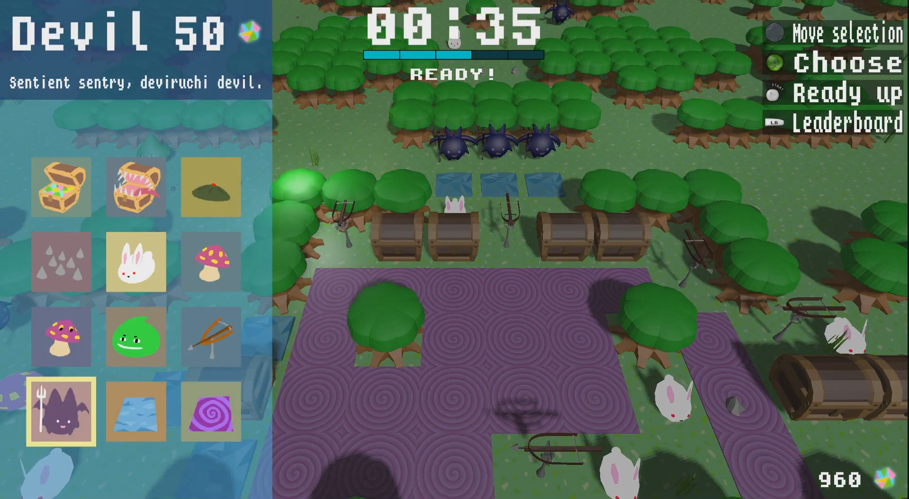

# Sandma

_Mario Party._

_The Binding of Isaac._

_Super Mario Maker._

Inspired by these genre-defining games, Sandma is unique spin on what makes
these games fun. It’s a blend of craftiness, competition, and chaos.

We’re creating a game that contains both the sense of exploration and
discovery of dungeon crawlers, and the chaotic and competitive interactions of
a party game. By combining these two together, we’re building a game where
players can compete with each other in mini games, use the points they obtain
to collectively build a dungeon full of both hazards and treasures, and
traverse this dungeon while avoiding their opponent’s obstacles. Players
compete to have the most amount of gold by the end of the game by avoiding
obstacles, winning mini games, and stealing from your opponents.

*A CSE 125 project by 9hack studios.*
